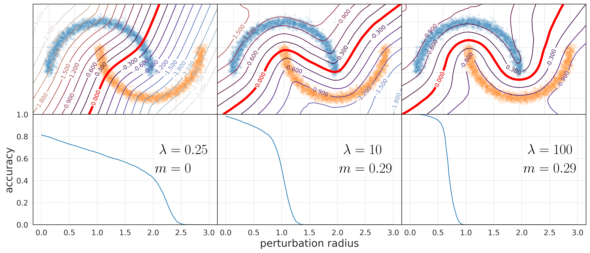
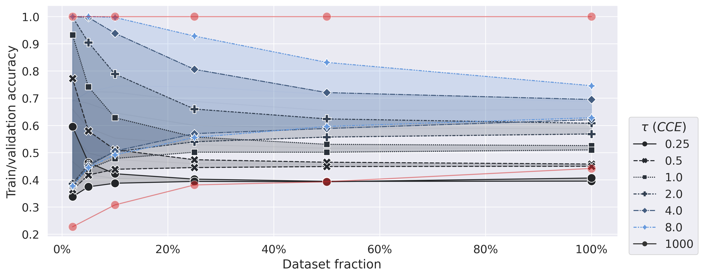
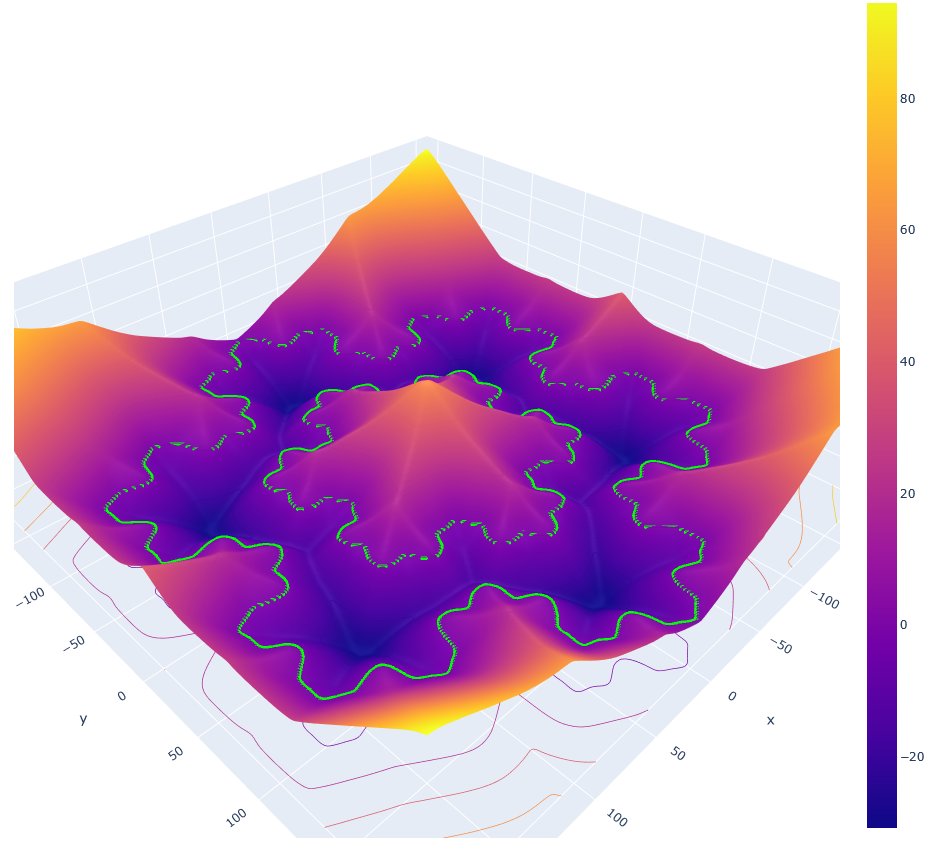

# Pay attention to your loss: understanding misconceptions about 1-Lipschitz Neural networks
*Béthune Louis, Boissin Thibaut, Serrurier Mathieu, Mamalet Franck, Friedrich Corentin, González-Sanz Alberto*

Official repository of the paper "Pay attention to your loss: understanding misconceptions about 1-Lipschitz Neural networks" accepted at Neurips 2022.
Arxiv version: [https://arxiv.org/abs/2104.05097](https://arxiv.org/abs/2104.05097)

To cite us:

```
@inproceedings{bethune2022pay,
  year = {2022},
  booktitle = {Advances in Neural Information Processing Systems (NeurIPS)},
  title = {Pay attention to your loss: understanding misconceptions about 1-Lipschitz neural networks},
  author = {Béthune, Louis and Boissin, Thibaut and Serrurier, Mathieu and Mamalet, Franck and Friedrich, Corentin and González-Sanz, Alberto},
}
```




The repository contains:
* The slides `slides.pdf`
* The poster `poster.pdf`
* and the code !

# Code

Our code for large scale experiments can be found in `.py` files.
Smaller scale experiments are in notebooks `.ipynb`: those can be uploaded on Google Colab and have been thought to work out of the box.  

## Dependencies

The Deel-Lip library is among the dependencies of the the library -- we embed its wheel `wheels/deel_lip-1.2.0-py2.py3-none-any.whl`. However notice that this library can be found online [here](https://github.com/deel-ai/deel-lip).  
  
The code uses custom data loaders and data augmentation pipelines in Deep Learning Toolbox (DLT) -- we embed its wheel `wheels/DLT-0.1.0-py2.py3-none-any.whl`.   
  
Take note of **PEP427**: "A wheel is a ZIP-format archive with a specially formatted file name and the .whl extension.". 




## Experiments in Appendix

Other Pareto front in Appendix can be generated using the `pareto-front-experiment.py` with appropriate arguments.  



